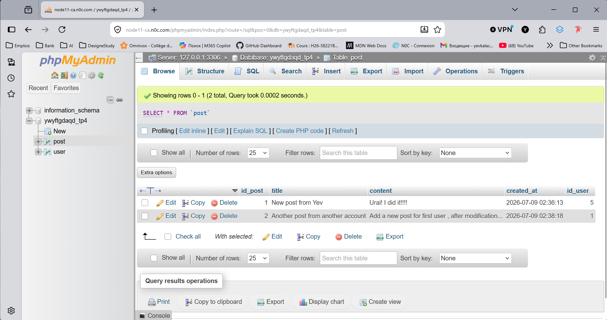
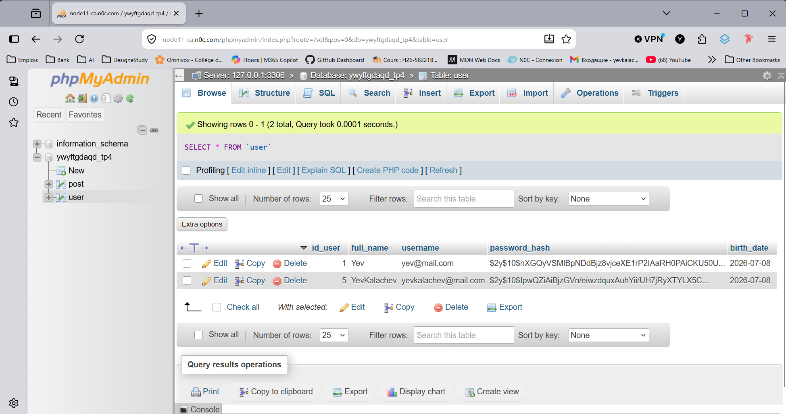

# TP4 — Déploiement d'une application PHP/MySQL sur N0C

---

## Project: "Community Forum "

``` text
Present déploiement d'une application "Community Forum"- PHP/MySQL depuis WSL d'ordinateur vers serveur N0C
```

---

## Structure du projet

```text
tp4_noc
├── .env
├── .env.example
├── .gitignore
├── composer.json
├── composer.lock
├── app
│   └── db.php
├── database
    ├── forum.sql
    └── dump.sql
└── public
    ├── index.php
    └── header.php
    └── footer.php
    └── register.php
    └── login
    └── logout
    └── add_post.php
    └── edit_post.php
    └── delete_post.php
    ├── css
         └── style.css

```

Le project permet de :

- cree un compte pour les clients;
- login et logout de compte ;
- cree un blog;
- supprimer ou redactee le blog;
- lire les blog l'outre utilisateurs;

---

### Lien

1. le lien vers mon dépôt GitHub : [https://github.com/yevkalachev/tp4_noc.git](https://github.com/yevkalachev/tp4_noc.git)
2. le lien vers mon application déployée sur N0C: [http://edw2-h26-tp4.e2595702.webdevmaisonneuve.ca/index.php](http://edw2-h26-tp4.e2595702.webdevmaisonneuve.ca/index.php) ;

## 1. Préparation du projet locale

J'ai' place mon projet  dans WSL  /var/www/tp4_noc

```bash
pour acces de project: cd /var/www/tp4_noc
```

À la racine du projet, créez un fichier `.env`.

```bash
sudo nano .env

```

Contenu de fichier .env :

```text
DB_HOST=localhost
DB_NAME=forum
DB_USER=root
DB_PASS=******
DB_CHARSET=utf8mb4
```

Ces informations correspondent la base de données locale dans WSL.

Le fichier `.env` dans la racine du projet.

```bash
/var/www/tp4_noc/.env
```

On ne met jamais le `.env` dans dossier `public`.Le dossier `public` est visible depuis le navigateur.

Créer le fichier `.env.example`.
Le fichier `.env.example` sert d’exemple.Ce fichier montre aux autres personnes quelles variables sont nécessaires pour faire fonctionner le projet.
Il peut être envoyé sur GitHub, car il ne contient pas les vrais mots de passe.

Créez le fichier :

```bash
sudo nano .env.example
```

Contenu de fichier .env.example :

```text
DB_HOST=localhost
DB_NAME=nom_de_la_base
DB_USER=nom_utilisateur
DB_PASS=mot_de_passe
DB_CHARSET=utf8mb4
```

---

### Adapter le fichier de connexion PHP

Dans notre projet, le fichier de connexion est :

```text
app/db.php
```

Il ne doit plus contenir directement les mots de passe.

J'ai remplace son contenu par ceci :

```php
<?php

$envPath = __DIR__ . '/../.env';

if (!file_exists($envPath)) {
    die("Error: .env file is missing.");
}

$env = parse_ini_file($envPath);

$host = $env['DB_HOST'] ?? 'localhost';
$dbname = $env['DB_NAME'] ?? '';
$user = $env['DB_USER'] ?? '';
$password = $env['DB_PASS'] ?? '';
$charset = $env['DB_CHARSET'] ?? 'utf8mb4';


$conn = mysqli_connect($host, $user, $password, $dbname);

if (!$conn) {
    die('Connection failed: ' . mysqli_connect_error());
}

mysqli_set_charset($conn, $charset);
?>
```

Pour utiliser cette script il fault utiliser composer.json :

```bash
composer require vlucas/phpdotenv
```

---

### Vérifier que le projet fonctionne encore en local

Dans le navigateur, testez  application locale.

```text
http://localhost
```

On ajouter une donnée.

Puis vérifiez dans MySQL :

```bash
mysql -u root -p tp4_noc
```

Puis :

```sql
SELECT * FROM messages;
```

l’application fonctionne encore localement, on pouvez passer à l’étape GitHub.

---

## 2. Préparation de GitHub

S’assurer que Git est installé dans WSL

Dans WSL, on tape :

```bash
git --version
```

Git est installé, on vois une version.

```text
git version 2.53.0
```

Mon identité Git deja configure, pour verifier :

```bash
git config --global --list
user.name=Yev Kalachev
user.email=yevkalachev@gmail.com
core.autocrlf=false
init.defaultbranch=main
```

Ignore le fichier `.env`

Avant d’envoyer le projet sur GitHub, il faut s’assurer que `.env` est ignoré.

Créer le fichier `.gitignore` :

```bash
nano .gitignore
```

Ajoute :

```text
.env
*.sql
composer.lock
*.log
.DS_Store
```

Vérifier que `.env` est bien ignoré :

```bash
git status
```

Le fichier `.env` ne  pas apparaître dans la liste des fichiers à envoyer.

Envoyer le projet sur GitHub

Dans le dossier du projet :

```bash
git init
git add .
git commit -m "First commit"
```

Créez ensuite un dépôt vide sur GitHub.

```text
repositories -> new -> tp4_noc
```

Puis associez votre projet local au dépôt GitHub :

```text
git remote add origin: https://github.com/yevkalachev/tp4_noc.git
```

Si la branche principale est - master, renommez :

```text
git branch -M main
```

Envoyez le code :

```bash
git push -u origin main
```

 ce stade, votre code est sur GitHub.

Important : mon fichier `.env` ne pas apparaitre sur GitHub.

---

### Exporter la base de données locale

Dans WSL, exportez votre base de données.

Exemple avec notre projet :

```bash
mysqldump --no-tablespaces -u root -p forum > database/dump.sql
```

Entrez le mot de passe MySQL local.

Vérifiez que le fichier existe :

```bash
ls -la database/dump.sql
```

Le fichier `.sql` contient la structure de la base et les données.

C’est ce fichier que vous allez importer dans phpMyAdmin sur N0C.

---

## 3. Préparation de la base de données N0C

Préparer N0C

On connect à :

[https://mg.n0c.com](https://mg.n0c.com)

On prépare trois choses :

```text
1. Une base de données
2. Un utilisateur MySQL
3. Un sous-domaine
```

---

### Créer la base de données dans N0C

Dans N0C, aller dans la section des bases de données.

Entre une section :

```text
MySQL
```

#### Crée une nouvelle base de données

Noter exactement le nom complet de la base de données.

Nom de la base de données :

```text
ywyftgdaqd_tp4
```

#### Crée un utilisatreur de base de donne

Noter exactement le nom complet d'utilisatreur.

```text
ywyftgdaqd_yev
```

#### Cree un mot de passe

Noter exactement le mot de passe.

```text
*************
```

---

### Importer la base de données avec phpMyAdmin

Dans N0C, aller dans :

```text
Databases -> PhpMyAdmin
```

Dans phpMyAdmin :

1. sélectionner la base de données N0C ;
2. cliquer sur l’onglet Import ;
3. choisisser le fichier `dump.sql` exporté depuis WSL ;
4. laisser le format sur SQL ;
5. cliquer sur Go ou Importer.

Après l’importation, vérifier que la table existe.

Exemple :

```sql
Databases -> PhpMyAdmin -> ywyftgdaqd_tp4
```

---

## 4. Connexion SSH à N0C

Se connecter à N0C en SSH

On récupére les informations SSH dans N0C.

Il  faut :

```text
Adresse du serveur - 199.16.129.193
Nom d’utilisateur SSH - ywyftgdaqd
Mot de passe ou clé SSH - ************
Port SSH - 5022
```

Depuis WSL, connecter avec :

```bash
ssh ywyftgdaqd@199.16.129.193 -p 5022
```

Si c’est la première connexion, le terminal peut demander une confirmation :

```text
Are you sure you want to continue connecting?
```

Répondes :

```text
yes
```

---

## 5. Récupération du projet sur N0C

S’assurer que Git est disponible sur N0C

Une fois connecté en SSH à N0C, verrifier disponibilite Git :

```bash
git --version
```

 Git est disponible.

```text
git version 2.43.5
```

Si Git n’est pas disponible, vous ne pourrez probablement pas l’installer vous-même avec `apt`, car vous êtes sur un hébergement géré.

Dans ce cas, il faut utiliser une autre méthode :

```text
File Manager de N0C
SFTP
scp
ou demander de l’aide à l’enseignante
```

Mais si Git est disponible, utilisez Git. C’est la méthode recommandée.

---

### Récupérer le projet sur N0C avec Git

Une fois connecté en SSH à N0C, on place dans notre dossier personnel :

```bash
cd ~
```

Clonez votre dépôt GitHub :

```bash
git clone https://github.com/yevkalachev/tp4_noc.git tp4_noc
```

Cela crée un dossier :

```text
~/tp4_noc
```

Vérifier :

```bash
ls -la tp4_noc
```

On  vois :

```text
[ywyftgdaqd@node11-ca ~]$ ls -la tp4_noc
total 3572
drwxrwxr-x  6 ywyftgdaqd ywyftgdaqd     148 Jul  9 01:12 .
drwx--x--x 11 ywyftgdaqd ywyftgdaqd     234 Jul  9 15:51 ..
-rw-rw-r--  1 ywyftgdaqd ywyftgdaqd     105 Jul  9 00:28 .env.example
drwxrwxr-x  8 ywyftgdaqd ywyftgdaqd     198 Jul  9 02:31 .git
-rw-rw-r--  1 ywyftgdaqd ywyftgdaqd      41 Jul  9 01:12 .gitignore
drwxrwxr-x  2 ywyftgdaqd ywyftgdaqd     130 Jul  9 01:12 .idea
drwxrwxr-x  2 ywyftgdaqd ywyftgdaqd      20 Jul  9 00:28 app
-rw-rw-r--  1 ywyftgdaqd ywyftgdaqd      62 Jul  9 00:28 composer.json
-rw-rw-r--  1 ywyftgdaqd ywyftgdaqd 3639279 Jul  9 01:12 composer.phar
drwxrwxr-x  3 ywyftgdaqd ywyftgdaqd     189 Jul  9 02:31 public
```

Le fichier `.env` ne pas là. Il est blockee par .gitignore

---

### Créer le fichier `.env` sur N0C

Sur N0C, créez le fichier `.env` à la racine du projet :

```bash
nano ~/tp4_noc/.env
```

On ajoute les informations de connexion de N0C.

Exemple :

```env
DB_HOST=localhost
DB_NAME=ywyftgdaqd_tp4
DB_USER=ywyftgdaqd_yev
DB_PASS=*******mot_de_passe_n0c*******
DB_CHARSET=utf8mb4
```

Important : utilisez les vraies informations affichées dans N0C.

Le fichier doit être ici :

```text
~/tp4_noc/.env
```

```text
[ywyftgdaqd@node11-ca ~]$ ls -la tp4_noc
total 3572
drwxrwxr-x  6 ywyftgdaqd ywyftgdaqd     148 Jul  9 01:12 .
drwx--x--x 11 ywyftgdaqd ywyftgdaqd     234 Jul  9 15:51 ..
-rw-rw-r--  1 ywyftgdaqd ywyftgdaqd     103 Jul  9 00:35 .env
-rw-rw-r--  1 ywyftgdaqd ywyftgdaqd     105 Jul  9 00:28 .env.example
drwxrwxr-x  8 ywyftgdaqd ywyftgdaqd     198 Jul  9 02:31 .git
-rw-rw-r--  1 ywyftgdaqd ywyftgdaqd      41 Jul  9 01:12 .gitignore
drwxrwxr-x  2 ywyftgdaqd ywyftgdaqd     130 Jul  9 01:12 .idea
drwxrwxr-x  2 ywyftgdaqd ywyftgdaqd      20 Jul  9 00:28 app
-rw-rw-r--  1 ywyftgdaqd ywyftgdaqd      62 Jul  9 00:28 composer.json
-rw-rw-r--  1 ywyftgdaqd ywyftgdaqd 3639279 Jul  9 01:12 composer.phar
drwxrwxr-x  3 ywyftgdaqd ywyftgdaqd     189 Jul  9 02:31 public
```

Il ne pas dans dossier public, et pas visible,disponible pour tout les monde :

```text
[ywyftgdaqd@node11-ca tp4_noc]$ ls -la public
total 36
drwxrwxr-x 3 ywyftgdaqd ywyftgdaqd  189 Jul  9 02:31 .
drwxrwxr-x 6 ywyftgdaqd ywyftgdaqd  148 Jul  9 01:12 ..
-rw-rw-r-- 1 ywyftgdaqd ywyftgdaqd 1945 Jul  9 02:31 add_post.php
drwxrwxr-x 2 ywyftgdaqd ywyftgdaqd   23 Jul  9 00:28 css
-rw-rw-r-- 1 ywyftgdaqd ywyftgdaqd  917 Jul  9 02:31 delete_post.php
-rw-rw-r-- 1 ywyftgdaqd ywyftgdaqd 2496 Jul  9 02:31 edit_post.php
-rw-rw-r-- 1 ywyftgdaqd ywyftgdaqd  155 Jul  9 00:28 footer.php
-rw-rw-r-- 1 ywyftgdaqd ywyftgdaqd 1341 Jul  9 02:31 header.php
-rw-rw-r-- 1 ywyftgdaqd ywyftgdaqd 1868 Jul  9 02:31 index.php
-rw-rw-r-- 1 ywyftgdaqd ywyftgdaqd 2045 Jul  9 02:31 login.php
-rw-rw-r-- 1 ywyftgdaqd ywyftgdaqd   88 Jul  9 01:12 logout.php
-rw-rw-r-- 1 ywyftgdaqd ywyftgdaqd 3216 Jul  9 02:31 register.php
```

Le `.env` doit rester en dehors du dossier public.

---

### Vérifier la structure du projet sur N0C

Dans le terminal SSH :

```bash
ls ~/tp4_noc
```

Vous devriez avoir :

```text
[ywyftgdaqd@node11-ca ~]$ ls -la tp4_noc
total 3572
drwxrwxr-x  6 ywyftgdaqd ywyftgdaqd     148 Jul  9 01:12 .
drwx--x--x 11 ywyftgdaqd ywyftgdaqd     234 Jul  9 15:51 ..
-rw-rw-r--  1 ywyftgdaqd ywyftgdaqd     103 Jul  9 00:35 .env
-rw-rw-r--  1 ywyftgdaqd ywyftgdaqd     105 Jul  9 00:28 .env.example
drwxrwxr-x  8 ywyftgdaqd ywyftgdaqd     198 Jul  9 02:31 .git
-rw-rw-r--  1 ywyftgdaqd ywyftgdaqd      41 Jul  9 01:12 .gitignore
drwxrwxr-x  2 ywyftgdaqd ywyftgdaqd     130 Jul  9 01:12 .idea
drwxrwxr-x  2 ywyftgdaqd ywyftgdaqd      20 Jul  9 00:28 app
-rw-rw-r--  1 ywyftgdaqd ywyftgdaqd      62 Jul  9 00:28 composer.json
-rw-rw-r--  1 ywyftgdaqd ywyftgdaqd 3639279 Jul  9 01:12 composer.phar
drwxrwxr-x  3 ywyftgdaqd ywyftgdaqd     189 Jul  9 02:31 public
```

Vérifier le dossier public :

```bash
ls ~/tp4_noc/public
```

On voir notre page d’accueil index.php.

Exemple :

```text
[ywyftgdaqd@node11-ca tp4_noc]$ ls -la public
total 36
drwxrwxr-x 3 ywyftgdaqd ywyftgdaqd  189 Jul  9 02:31 .
drwxrwxr-x 6 ywyftgdaqd ywyftgdaqd  148 Jul  9 01:12 ..
-rw-rw-r-- 1 ywyftgdaqd ywyftgdaqd 1945 Jul  9 02:31 add_post.php
drwxrwxr-x 2 ywyftgdaqd ywyftgdaqd   23 Jul  9 00:28 css
-rw-rw-r-- 1 ywyftgdaqd ywyftgdaqd  917 Jul  9 02:31 delete_post.php
-rw-rw-r-- 1 ywyftgdaqd ywyftgdaqd 2496 Jul  9 02:31 edit_post.php
-rw-rw-r-- 1 ywyftgdaqd ywyftgdaqd  155 Jul  9 00:28 footer.php
-rw-rw-r-- 1 ywyftgdaqd ywyftgdaqd 1341 Jul  9 02:31 header.php
-rw-rw-r-- 1 ywyftgdaqd ywyftgdaqd 1868 Jul  9 02:31 index.php
-rw-rw-r-- 1 ywyftgdaqd ywyftgdaqd 2045 Jul  9 02:31 login.php
-rw-rw-r-- 1 ywyftgdaqd ywyftgdaqd   88 Jul  9 01:12 logout.php
-rw-rw-r-- 1 ywyftgdaqd ywyftgdaqd 3216 Jul  9 02:31 register.php
```

Vérifier le dossier app :

```bash
ls ~/tp4_noc/app
```

On voir :

```text
[ywyftgdaqd@node11-ca tp4_noc]$ ls -la app
total 4
drwxrwxr-x 2 ywyftgdaqd ywyftgdaqd  20 Jul  9 00:28 .
drwxrwxr-x 6 ywyftgdaqd ywyftgdaqd 148 Jul  9 01:12 ..
-rw-rw-r-- 1 ywyftgdaqd ywyftgdaqd 532 Jul  9 00:28 db.php
```

---

## 6. Configuration du sous-domaine N0C

Dans N0C, on aller dans :

```text
Domaine -> Gestion de domaine
```

```text
un sous-domaine
edw2-h26-tp4.e2595702.webdevmaisonneuve.ca 
```

Le point le plus important est le Document Root.

Le Document Root doit pointer vers :

```text
/tp4_noc/public
```

et non vers :

```text
/tp4_noc/
```

Parce que le navigateur doit seulement accéder au contenu public du projet.

Si je pointer vers `tp4_noc`, je risque d’exposer des fichiers internes comme :

```text
app/db.php
.env
```

Ces fichiers ne doivent pas être visibles depuis le navigateur.Le dossier public contient mon fichier index.php. Le sous-domaine pointe vers public afin de ne pas exposer les fichiers sensibles comme .env ou app/db.php.

---

## 7. Accéder à l’application dans le navigateur

Après avoir configuré le domaine ou sous-domaine, ouvrez :

[http://edw2-h26-tp4.e2595702.webdevmaisonneuve.ca/](http://edw2-h26-tp4.e2595702.webdevmaisonneuve.ca/)

Si tout fonctionne, votre application devrait s’afficher.

J'ai tester ensuite les action réelles :

```text
Ajouter un utilisateur
Ajouter un message
Modifier une donnée
Supprimer une donnée
```

### Vérification dans phpMyAdmin

Puis je vérifier dans phpMyAdmin que la donnée est bien présente dans la base .



---

## 8. Mettre à jour le projet après une modification

Lorsque je modifier mon code en local dans WSL :

```bash
git add .
git commit -am "Modification du projet"
git push
```

Ensuite, connecter à N0C en SSH :

```bash
ssh ywyftgdaqd@199.16.129.193 -p 5022
```

Puis :

```bash
cd ~/tp4_noc
git pull
```

Mon code sur N0C est mis à jour.

Le fichier `.env` sur N0C reste en place, car il n’est pas géré par Git.

---
